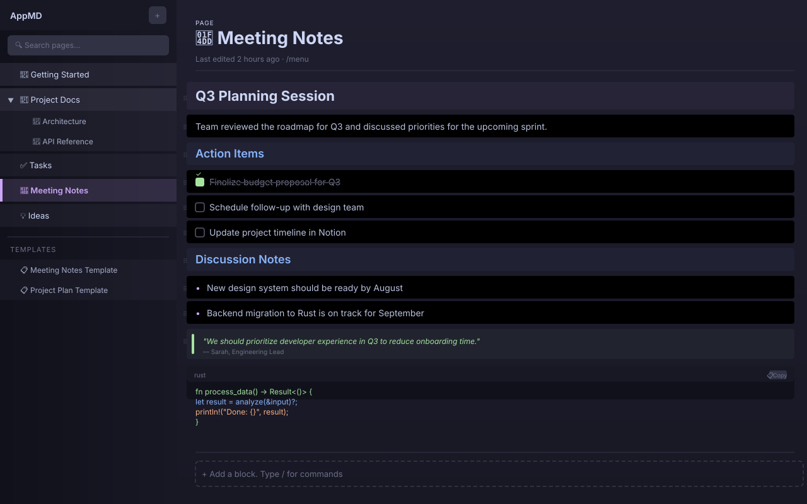

# AppMD

<div align="center">

[](LICENSE)
[](https://github.com/davidvar1/appmd/stargazers)
[](https://rustup.rs/)

**A local-first, open-source Notion-like editor built with Rust and egui.**

100% local. No cloud. No subscriptions. No accounts.

</div>

## Overview

AppMD (formerly Ferrite) is a [Notion](https://notion.so)-inspired document editor that runs entirely on your machine. Your data never leaves your computer — stored in a local SQLite database, authored in familiar Markdown.

| What | AppMD | Notion |
|------|-------|--------|
| **Data** | 100% local SQLite | Cloud-only |
| **Cost** | Free (MIT) | $10+/month |
| **Account** | None required | Required |
| **Editor** | Native Rust/egui | Electron/Web |
| **Format** | Native Markdown | Proprietary blocks |
| **Open Source** | ✓ MIT | ✗ Proprietary |

## Mockup



> **Work in progress.** The mockup above shows the target UI. The page tree sidebar and block editor are implemented — slash commands and block drag-and-drop are next.

## Current State (MVP)

### ✅ Implemented

- **SQLite page/block store** — Full CRUD for pages, blocks, databases, templates, backlinks
- **Page tree sidebar** — Hierarchical page tree with search, rename, drag-and-drop reordering, context menu
- **Block editor** — 15 block types rendered inline:
  - Text, Heading 1/2/3, To-do (checkboxes), Bulleted List, Numbered List
  - Toggle, Code (with syntax), Quote, Divider, Callout, Image, Bookmark, Equation
- **Keyboard shortcuts** — `Ctrl+Shift+N` to toggle page tree
- **Local storage** — Database at `{data_dir}/AppMD/pages.db`

### 🔜 Coming Next

- `/` slash commands for block type switching
- Drag-and-drop block reordering
- Markdown ↔ Block import/export
- Database / table views

## Tech Stack

| Component | Technology |
|-----------|------------|
| Language | Rust 1.70+ |
| GUI | egui 0.31 + eframe 0.31 |
| Storage | SQLite (rusqlite 0.31, bundled) |
| IDs | UUID v4 |
| Markdown | comrak 0.22 |
| Text Buffer | ropey 1.6 |
| Syntax Highlighting | syntect 5.1 |
| i18n | rust-i18n 4 + sys-locale |
| Git | git2 0.19 |
| Terminal | portable-pty 0.8 |

## Getting Started

```bash
# Clone
git clone https://github.com/davidvar1/appmd.git
cd appmd

# Build (release)
cargo build --release

# Run
./target/release/appmd
```

## Keyboard Shortcuts

| Shortcut | Action |
|----------|--------|
| `Ctrl+Shift+N` | Toggle page tree sidebar |
| `Ctrl+N` | New file |
| `Ctrl+O` | Open file |
| `Ctrl+S` | Save |
| `Ctrl+W` | Close tab |
| `Ctrl+,` | Settings |

## Project Structure

```
src/
├── store/           # SQLite store (pages, blocks, databases, templates)
│   ├── mod.rs       # SqliteStore with CRUD operations
│   ├── block_types.rs  # BlockType enum (15 types)
│   └── schema.rs    # Database schema & migrations
├── ui/              # UI widgets
│   ├── page_tree.rs     # Hierarchical page tree sidebar
│   ├── page_editor.rs   # Block-based page editor
│   └── block_editor.rs  # Single block renderer
├── app/             # Application shell (eframe::App)
│   ├── mod.rs       # AppMDApp main struct
│   ├── central_panel.rs # Central editor area
│   └── keyboard.rs  # Keyboard shortcuts
└── state.rs         # AppState & PageEditorState
```

## Background

AppMD started as [Ferrite](https://github.com/OlaProeis/Ferrite), a Markdown text editor. The Notion-like block system is being built as a superset — you still get all the original text editing features (syntax highlighting, multi-cursor, code folding, integrated terminal, Git integration, and more).

## License

MIT — see [LICENSE](LICENSE).

---

Built with Rust and egui.
