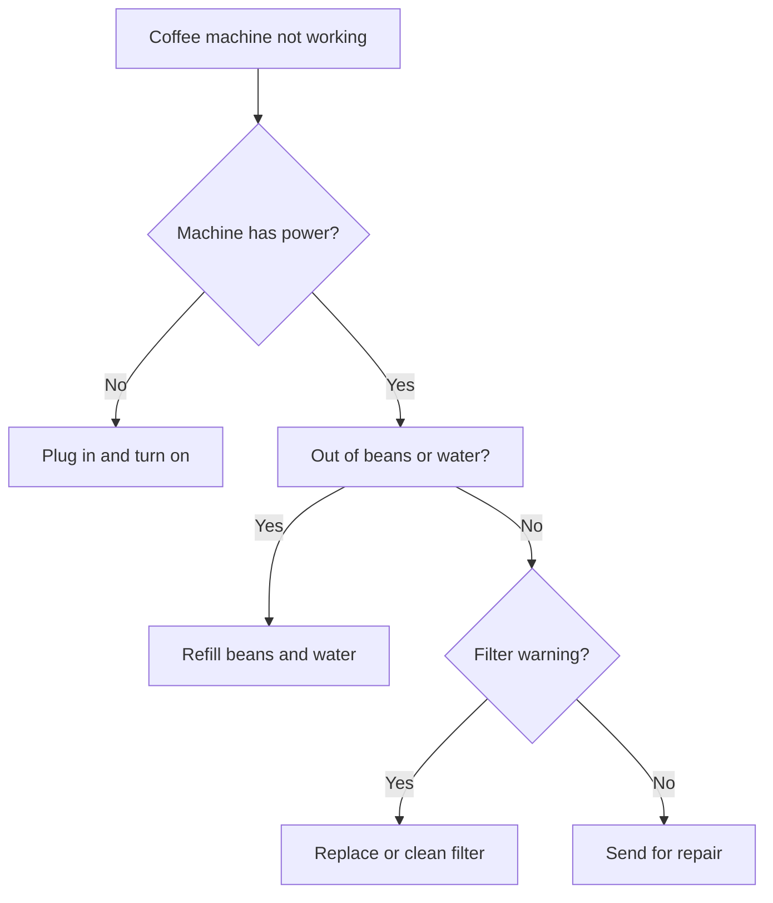

# Session Handover

## Environment

- **Project:** Ferrite (markdown editor, Rust + egui)
- **Tech Stack:** Rust 2021, egui 0.31.1 + eframe 0.31.1
- **Context file:** Always read [`docs/ai-context.md`](./ai-context.md) first — project rules, architecture, conventions.
- **Branch:** master
- **Goal:** Improve native Mermaid **rendering** before v0.3.0 ships (GitHub #83).

## Handover Rules

- **NO HISTORY:** Replace this file when the active task changes; do not accumulate past narratives.
- **SCOPE:** Flowchart **horizontal spacing / overlap** (primary). FC-83a edge polish is secondary unless a spacing fix regresses it.
- Run `cargo build` / `cargo test layout_coffee fc_83a obstacle_tests` after code changes.
- Update layout docs when spacing algorithm changes (see Key docs below).
- Use Context7 MCP for egui/library docs when needed.
- Do **not** switch to mmdr or SVG — keep native egui rendering.

---

## Current Task: Flowchart branch spacing — fix squished / overlapping nodes

Wide branching flowcharts render with **sibling nodes overlapping** in Ferrite. Mermaid.js spreads branches horizontally; Ferrite stacks them too tight or shifts parents onto siblings.

### Primary repro (user-reported)

Open [`test_md/test_flowcharts.md`](../test_md/test_flowcharts.md) — first diagram (**Coffee machine troubleshooting**) in **Rendered** or **Split** view. Compare to [Mermaid Live Editor](https://mermaid.live).



**Observed (Ferrite):** `C` overlaps `H`; `D` overlaps `G`; branches feel vertically compressed.  
**Expected (Mermaid.js):** siblings separated horizontally, no bbox intersection.

### Secondary repro (regression guard)

[`test_md/test_mermaid_issue_83.md`](../test_md/test_mermaid_issue_83.md) — FC-83a feedback loop. Edge routing improved but still not pixel-perfect vs Mermaid; do not break inner/outer back-edge lanes when fixing spacing.

---

## Root cause (investigated this session)

`assign_coordinates_with_subgraphs` in [`sugiyama.rs`](../src/markdown/mermaid/flowchart/layout/sugiyama.rs) places siblings left-to-right with fixed `node_spacing.x` (**50 px** in [`layout/mod.rs`](../src/markdown/mermaid/flowchart/layout/mod.rs)).

**Regression:** post-pass `align_branch_nodes_to_children()` (added for FC-83a) shifts branch nodes (2+ forward children) to the **barycenter of their children’s x** without re-spacing the layer or checking sibling overlap.

Measured overlaps at `available_width=800` (`EstimatedTextMeasurer`, `cargo test test_layout_coffee_machine_all_nodes -- --nocapture`):

| Layer (y) | Nodes | Problem |
|-----------|-------|---------|
| 220 | H, C | H right ≈ **362**, C left ≈ **294** → overlap ~68 px |
| 320 | G, D | G right ≈ **406**, D left ≈ **327** → overlap ~79 px |
| 420 | I, F | OK (no overlap) |

Without the barycenter post-pass, H/C were spaced correctly (H right < C left). **The post-pass moves C and D left onto siblings.**

---

## Next steps (priority order)

### 1. Fix overlap from branch barycenter (`sugiyama.rs`)

Pick one approach (or combine):

- **A. Collision-aware shift:** after barycenter move, if node intersects a same-layer sibling, push apart or reject the shift.
- **B. Layer re-pack:** after all barycenter adjustments, re-run horizontal packing per layer (preserve relative order, enforce `gap >= node_spacing` or `gap >= padding`).
- **C. Scope the post-pass:** only shift nodes that are **alone on their layer** (FC-83a `decide` case); never shift nodes that share a layer with siblings.
- **D. Two-phase layout:** compute barycenter **target** during coordinate assignment (dagre-style) instead of mutating positions after packing.

Start with **C** (smallest fix) or **B** (more general). Verify coffee chart visually + add overlap assertion test.

### 2. Minimum horizontal gap / layer width

Even without barycenter, 50 px spacing may be tight for long labels. Consider:

- `node_spacing.x` proportional to max sibling width or font size
- Layer `start_cross` from **actual packed width**, not sum of widths when nodes were placed before shifts
- Post-layout `resolve_layer_overlaps()` utility

### 3. Tests to add / extend

| Test | File | Assert |
|------|------|--------|
| Coffee machine no overlap | `src/markdown/mermaid/mod.rs` | For each layer, sibling rects `right + spacing <= next.left` |
| FC-83a layout | existing `test_fc_83a_layout_has_all_nodes` | Keep branch + axis assertions |
| FC-83a edges | `flowchart/render/edges.rs` `back_edge_tests` | E→B clears `decide` |

```bash
cargo test test_layout_coffee_machine
cargo test fc_83a
cargo test obstacle_tests
```

### 4. FC-83a edge polish (defer until spacing fixed)

Partially done; user feedback “a bit better”:

- Inner E→B: top-right exit, rise along E’s east edge, enter Preview right at mid-height
- Outer F→B: margin loop, bottom-right entry
- Branch barycenter shifts `decide` left (may need collision-aware version from step 1)

Still out of scope: `linkStyle interpolate basis` curves, Font Awesome (FC-83b).

---

## Key files

| File | Role |
|------|------|
| [`flowchart/layout/sugiyama.rs`](../src/markdown/mermaid/flowchart/layout/sugiyama.rs) | Layer assignment, `assign_coordinates_with_subgraphs`, **`align_branch_nodes_to_children`** ← likely fix here |
| [`flowchart/layout/mod.rs`](../src/markdown/mermaid/flowchart/layout/mod.rs) | `FlowLayoutConfig`, `node_spacing`, `layout_flowchart` entry |
| [`flowchart/layout/config.rs`](../src/markdown/mermaid/flowchart/layout/config.rs) | Spacing constants |
| [`flowchart/render/edges.rs`](../src/markdown/mermaid/flowchart/render/edges.rs) | Back-edge lanes, inner direct path (FC-83a) |
| [`flowchart/render/mod.rs`](../src/markdown/mermaid/flowchart/render/mod.rs) | Painter sizing, `side_pad` for back-edges |

## Key docs

| Doc | When to update |
|-----|----------------|
| [`flowchart-branch-ordering.md`](./technical/mermaid/flowchart-branch-ordering.md) | Branch order conventions |
| [`flowchart-edge-obstacle-routing.md`](./technical/mermaid/flowchart-edge-obstacle-routing.md) | Edge routing only |
| [`mermaid-parity-matrix.md`](./technical/mermaid/mermaid-parity-matrix.md) | Status after spacing fix |

---

## Pass criteria (spacing task)

- [ ] Coffee machine chart: **no sibling bbox overlap** at 800 px width
- [ ] Branch order preserved (H left of C; G left of D; I left of F)
- [ ] FC-83a: all nodes visible; E→B does not pass through `decide`; F→B separate lane
- [ ] `test_md/test_flowcharts.md` spot-check (shapes, subgraphs, linkStyle)
- [ ] New overlap regression test in `mod.rs`

---

## Verification

```bash
cargo build
cargo test test_layout_coffee_machine_all_nodes -- --nocapture
cargo test fc_83a
cargo test obstacle_tests
```

Manual: coffee diagram + FC-83a vs Mermaid Live; check wide labels and nested branches.
